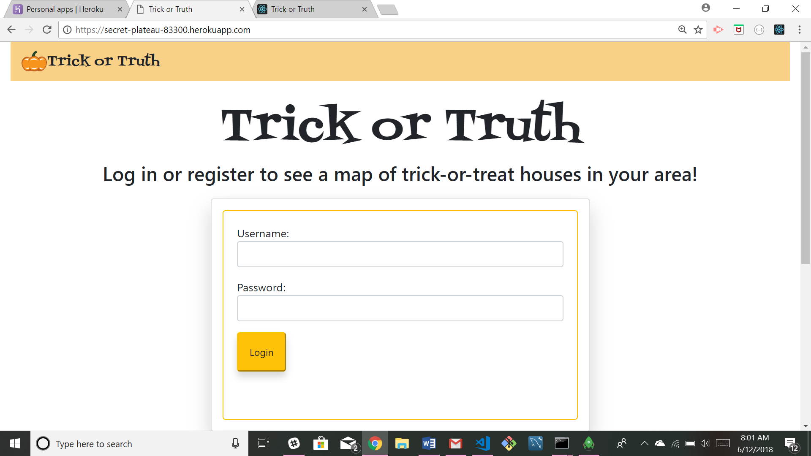
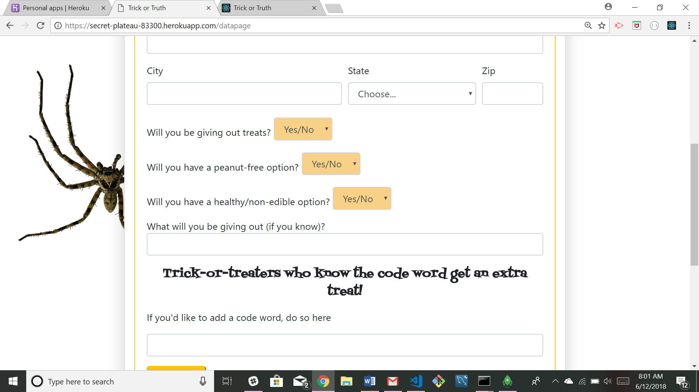
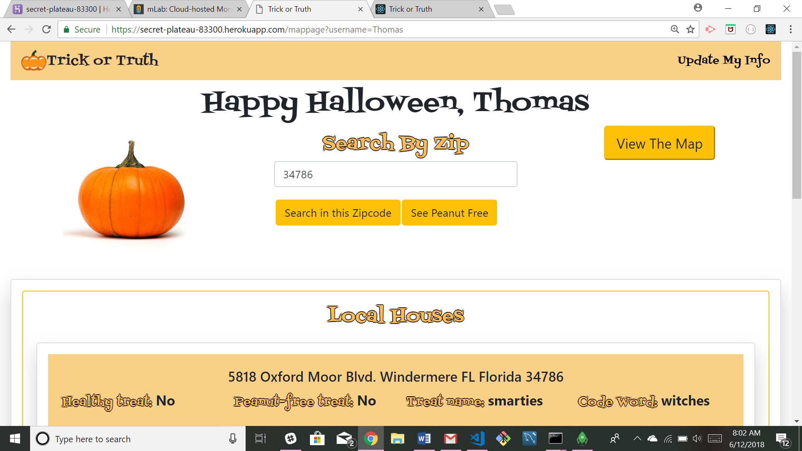
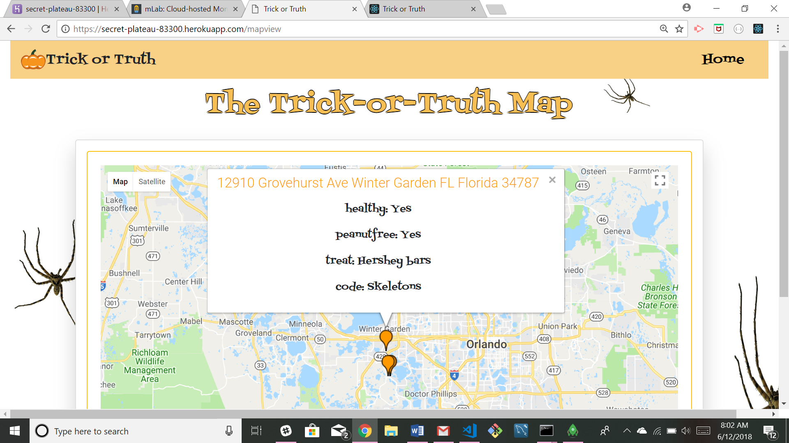

# TrickorTruth

This project was created by Jaime Halupka as a requirement for homework during University of Central Florida's Coding Bootcamp. 

### Screenshots

Login Screen

Survey page

Data page

Map page

  
### Description

This application allows a user to register their address for trick-or-treating. After completing a simple survey, the user is directed to a page which allows them to search for homes participating in trick-or-treating by zipcode. They can also search for homes giving out peanut-free treats. Users can update their info if they choose. There is also an option to view a map where pins are rendered with clickable info windows which displays information for each house. 

### Link to Application

[Heroku Link](https://secret-plateau-83300.herokuapp.com/)

### Technology

Created using MERN stack.
